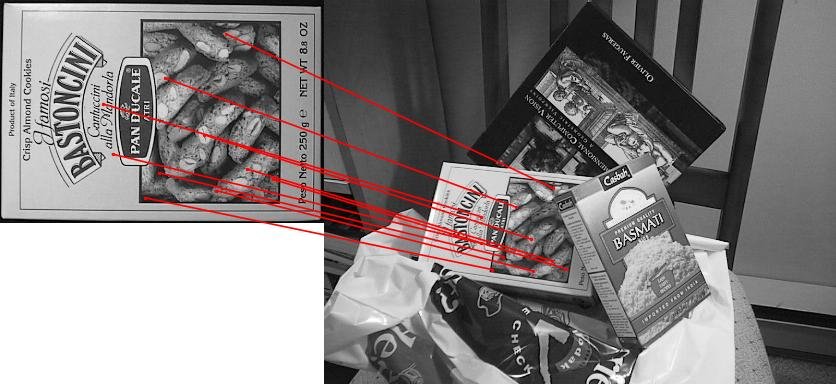
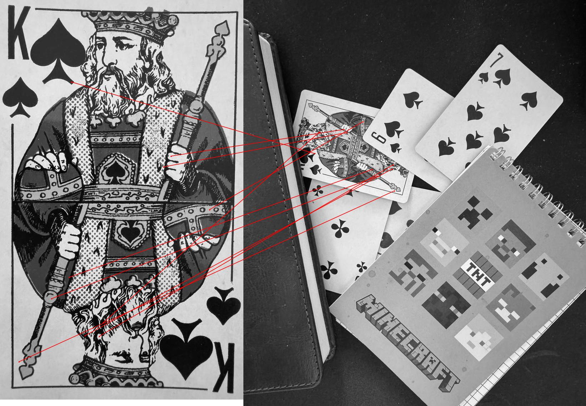
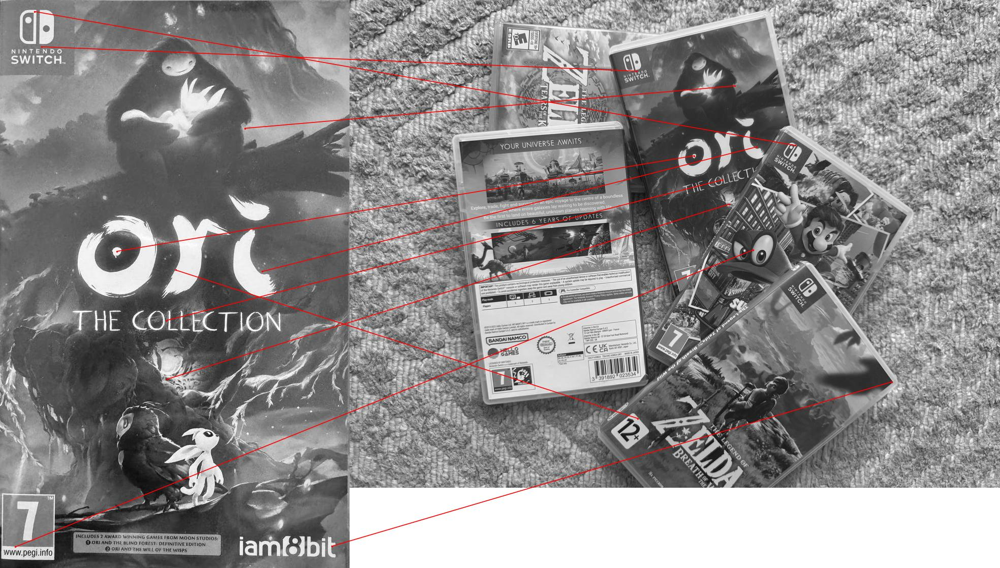

# SIFT Feature Detector

**A lightweight, dependency-free implementation of Scale-Invariant Feature Transform**
*Designed for easy integration into embedded systems and computer vision pipelines*

## 🛠️ TODO

- SIMD optimizations

## 📦 Installation

### Requirements

Make sure the following dependencies are installed:

- make
- gcc

### Build

```bash
make
```

### ▶️ Usage

```
SIFT Feature Tool v1.0
Usage:
  sift [options] <image1> [image2]

Options:
  --contrast <value>  Set contrast threshold (default: 0.03)
  --edge <value>      Set edge threshold (default: 10.0)
  --layers <n>        Layers per octave (default: 3)
  --output <file>     Save keypoints to file
  --help              Show this help

Examples:
  Detect keypoints: sift_tool image.jpg
  Find matches: sift_tool image1.jpg image2.jpg
```

## 🖼️ Example Results





